<div align="center">

# JujurParkir

### Tarif parkir resmi Surabaya, terbaca sebelum uangnya berpindah

[](https://jujur-parkir.vercel.app/)
[](https://github.com/reyhanamando35/JujurParkir)
[](LICENSE)

**Submission for ITECHNO CUP 2026 - Web Development**

**By KELOMPOK KONTRAK**

</div>

---

## Daftar Isi

- [Tim Developer](#-tim-developer)
- [Tentang Proyek](#-tentang-proyek)
- [Ruang Lingkup](#-ruang-lingkup)
- [Fitur Unggulan](#-fitur-unggulan)
- [Demo & Screenshot](#-demo--screenshot)
- [Teknologi](#-teknologi)
- [Arsitektur Sistem](#-arsitektur-sistem)
- [Keamanan & Privasi](#-keamanan--privasi)
- [Batasan Sistem](#-batasan-sistem)
- [Instalasi & Setup](#-instalasi--setup)
- [Penggunaan](#-penggunaan)
- [API Documentation](#-api-documentation)
- [Testing](#-testing)
- [Lisensi](#-lisensi)
- [Daftar Pustaka](#-daftar-pustaka)

---

## 👥 Tim Developer

| Nama | Peran | GitHub |
|------|-------|--------|
| **Reyhan Amando Matakupan** | Features & Tech Lead | [GitHub](https://github.com/reyhanamando35) |
| **Marcel Hans Sasongko** | Data Scraping | [GitHub](https://github.com/marcelhanss) |
| **Joseph Evan Tanujaya** | Database & QA | [GitHub](https://github.com/joseph-beginner-programmer) |

---

## 📖 Tentang Proyek

### Latar Belakang

Parkir liar dan tarif di atas ketentuan bukan kejadian sesekali di Surabaya, melainkan persoalan yang berulang dan sudah lama ditindak.

Pada Desember 2025, empat juru parkir di kawasan Tanjung Anom, Kecamatan Genteng, diamankan polisi. Keempatnya tidak bisa menunjukkan izin resmi sebagai petugas parkir dan menarik tarif melebihi ketentuan — perbuatan yang diduga melanggar Perda Kota Surabaya Nomor 7 Tahun 2023 [1]. Kasus itu bukan satu-satunya: sepanjang Januari sampai 7 Desember 2025 tercatat 131 juru parkir liar yang ditindak, dan menurut Kasat Samapta Polrestabes Surabaya, mayoritas beroperasi di kawasan larangan parkir, tanpa izin resmi, sekaligus memungut tarif di atas ketentuan [2].

Persoalannya juga bertahan lintas dua rezim peraturan. Kepala Dishub Kota Surabaya pernah mengakui masih adanya oknum juru parkir yang menarik tarif melebihi ketentuan pada masa Perda Nomor 3 Tahun 2018 — aturan yang berlaku sebelum Perda 7/2023 [5]. Artinya yang kita hadapi bukan gejolak sesaat setelah aturan baru terbit. Bahkan pada akhir Agustus 2026 persoalan perparkiran masih aktif dibicarakan di tingkat kota: Wali Kota Eri Cahyadi menindaklanjuti laporan seorang juru parkir mengenai setoran tunai yang masih berjalan, dan menyatakan siap mengganti pejabat Dishub, pengawas, maupun juru parkir yang tidak menjalankan sistem non-tunai [4].

Yang paling menentukan arah proyek ini adalah bagaimana penertiban itu dipicu. Dalam operasi gabungan Dishub bersama Polrestabes, Kogartap III, dan Satpol PP, Kepala UPTD Parkir Tepi Jalan Umum menyatakan bahwa penertiban dilakukan **berdasarkan laporan masyarakat** yang masuk melalui kanal aduan Pemkot dan media sosial — dan bahwa juru parkir liar kerap kembali beroperasi setelah ditertibkan [3]. Dua hal itu digabung berarti: laporan warga sudah menjadi bahan bakar penertiban, dan karena pelanggarnya berulang, aliran laporan itu perlu terus mengalir.

Di sinilah celahnya. Warga yang sedang berdiri di pinggir jalan dan diminta membayar Rp10.000 tidak punya cara cepat untuk menjawab dua pertanyaan paling dasar: **berapa tarif resmi di sini, dan apakah titik ini memang terdaftar?** Tanpa jawaban itu, ia tidak punya dasar untuk menolak, dan juga tidak punya keyakinan cukup untuk melapor.

### Asal Usul Data

Proyek ini berangkat dari **1.235 titik parkir tepi jalan umum** yang dipublikasikan Dinas Perhubungan Kota Surabaya melalui dashboard data titik parkir. Data aslinya berisi alamat, nama lokasi, dan jam jaga — **tanpa koordinat sama sekali**. Karena itu seluruh koordinat pada aplikasi ini **kami geokodekan sendiri** menggunakan Nominatim (OpenStreetMap), dengan pencarian dibatasi pada kotak wilayah Surabaya.

Konsekuensi dari geocoding mandiri itu kami tanggung secara terbuka, bukan disembunyikan — lihat [Batasan Sistem](#-batasan-sistem).

### Solusi yang Ditawarkan

JujurParkir menyatukan dua hal yang selama ini terpisah menjadi satu halaman yang bisa dibuka dalam hitungan detik di pinggir jalan:

1. **Peta 1.235 titik parkir resmi** beserta rentang tarif rujukan menurut Perda 7/2023 [6]. Warga bisa mencari nama jalan, membuka satu titik, dan langsung melihat berapa yang seharusnya dibayar.
2. **Kanal pelaporan tanpa akun**, dengan dua jalur: melaporkan titik yang terdaftar, atau menandai pin di lokasi yang **tidak** ada dalam registri Dishub.

Sisi petugas mendapat dasbor verifikasi, dan angka laporan yang sudah masuk ditampilkan terbuka kepada warga — sehingga peta ini bukan hanya alat lapor, tapi juga alat transparansi.

### Tujuan Proyek

- **Tujuan Utama**: memberi warga jawaban atas "berapa tarif resmi di titik ini" sebelum uang berpindah tangan, dan memberi Dishub aliran laporan yang terstruktur, berkoordinat, dan siap ditindaklanjuti.
- **Target Pengguna**: warga Kota Surabaya yang sedang berada di lokasi parkir; petugas Dishub dan Koordinator Wilayah (Katar) yang menindaklanjuti laporan.
- **Value Proposition**: aplikasi ini **tidak pernah menampilkan angka yang tidak bisa ditelusuri**. Setiap tarif wajib menyebut sumber pasalnya, setiap koordinat yang hanya perkiraan ditandai sebagai perkiraan, dan setiap laporan dinyatakan sebagai keterangan warga — bukan putusan pelanggaran. Kejujuran soal ketidaktahuan itu justru yang membuat angka yang ditampilkan bisa dipercaya.

---

## 🎯 Ruang Lingkup

### Input

| Sumber | Isi | Cara masuk |
|--------|-----|------------|
| Dashboard titik parkir Dishub Kota Surabaya | 1.235 baris: alamat, nama lokasi, jam jaga | Scraping (Selenium) → CSV |
| Nominatim / OpenStreetMap | Koordinat lintang–bujur per alamat | Geocoding batch (geopy) |
| Perda Kota Surabaya 7/2023 [6] | Tarif rujukan per kategori, kendaraan, dan mode bayar | Diinput petugas Dishub lewat `/petugas/tarif`, kolom sumber wajib diisi rujukan pasal |
| Warga | Jenis keluhan, jenis kendaraan, waktu kejadian, catatan, foto opsional, titik atau pin lokasi | Form di `/warga`, tanpa akun |
| Petugas | Perubahan status laporan, tindak lanjut, penetapan kategori tarif per titik | Form di `/petugas/*`, wajib login |

### Proses

1. **Pipeline data** — `scraping/*.py` mengambil data mentah, `scripts/build-titik.mjs` mengubah satu CSV menjadi dua keluaran sekaligus: `public/data/titik-parkir.geojson` untuk peta, dan `supabase/migrations/0002_seed_titik.sql` untuk basis data. Skrip ini **berhenti dengan galat** bila menemukan tabrakan hash atau koordinat di luar kotak Surabaya.
2. **Identitas titik** — `kode_titik` adalah 8 heksadesimal pertama dari `sha256(alamat|lokasi)` yang dinormalisasi, bukan nomor urut scraping. Tujuannya agar laporan warga tidak salah sasaran ketika sumbernya di-scrape ulang.
3. **Penyajian peta** — geometri dibaca dari GeoJSON statis; atribut yang bisa berubah (kategori tarif, mode progresif, status nonaktif) diambil dari Supabase dan dicocokkan lewat `kode_titik`.
4. **Pelaporan** — Server Action memvalidasi isian, memeriksa kuota harian di basis data, menyandikan ulang foto untuk membuang metadata, lalu menyimpan baris laporan dan mengembalikan kode 6 karakter.
5. **Verifikasi** — petugas mengubah status; Postgres mencatat siapa dan kapan. Perubahan itu langsung terlihat warga lewat halaman cek status.
6. **Agregasi publik** — dua view basis data menghitung jumlah laporan 30 hari terakhir per titik dan per wilayah, tanpa pernah mengeluarkan satu baris laporan pun.

### Output

- Peta interaktif 1.235 titik dengan popup berisi jam jaga, rentang tarif motor dan mobil, keterangan tingkat verifikasi, sumber pasal, dan jumlah laporan warga.
- Kode laporan 6 karakter untuk pelapor, plus halaman cek status publik.
- Angka laporan terbuka per titik dan per wilayah di halaman warga.
- Dasbor petugas: grafik laporan harian 14 hari, sebaran wilayah, sebaran jam tutup, dan tabel laporan yang bisa disaring dan diubah statusnya.

### Batasan Ruang Lingkup

Yang **tidak** termasuk dalam proyek ini: pembayaran parkir, integrasi ke sistem non-tunai Dishub, penentuan sanksi, identifikasi juru parkir perorangan, dan penambahan titik parkir baru oleh siapa pun selain melalui pipeline data resmi. Rincian lengkapnya ada di [Batasan Sistem](#-batasan-sistem).

### Alur per Fitur

| Fitur | Input | Proses | Output | Batas |
|-------|-------|--------|--------|-------|
| **Peta titik** | Pembukaan halaman `/warga` | GeoJSON statis digambar di atas peta vektor PMTiles; penanda digugus (cluster); atribut tarif ditempel dari Supabase | 1.235 pin, angka laporan pada gugus dan pin | Geometri statis — titik baru hanya muncul setelah pipeline dijalankan ulang |
| **Pencarian titik** | Ketikan ≥ 2 karakter | Pencocokan per-kata di array yang **sudah ada di memori**; tanpa permintaan jaringan | Maksimal 8 saran; dipilih → peta terbang ke titik dan popup terbuka | Hanya mencari alamat dan nama lokasi; bukan pencarian fuzzy |
| **Laporan Jalur A** (titik terdaftar) | Titik resmi dipilih dari peta + jenis keluhan, kendaraan, waktu, catatan, foto opsional | Validasi server, cek kuota, foto disandikan ulang, simpan dengan `titik_kode` | Kode laporan 6 karakter | Jenis keluhan yang sah dibatasi per jalur; laporan tidak diverifikasi kebenarannya |
| **Laporan Jalur B** (di luar daftar) | Pin digeser warga di peta | Koordinat divalidasi harus di dalam kotak Surabaya; wilayah diturunkan dari koordinat | Kode laporan + laporan masuk hitungan agregat wilayah | Wilayah adalah perkiraan, bukan batas administratif |
| **Dasbor petugas** | Login petugas | RLS Postgres menentukan baris yang terlihat; laporan Jalur B dilengkapi 3 titik resmi terdekat yang dihitung di server | Grafik, tabel tersaring, pengubah status | Katar hanya melihat wilayahnya; batas ini ditegakkan basis data, bukan antarmuka |

---

## ✨ Fitur Unggulan

### Fitur Utama

| Fitur | Deskripsi | Keunggulan |
|-------|-----------|------------|
| **Peta tarif 1.235 titik** | Peta vektor Surabaya dengan seluruh titik parkir tepi jalan umum resmi, lengkap dengan rentang tarif per kendaraan | Berkas peta disajikan dari server sendiri (PMTiles 21 MB) dan di-cache sehari, sehingga tetap terbaca pada sinyal buruk — kondisi normal bagi orang yang sedang berdiri di pinggir jalan |
| **Pencarian dalam memori** | Kotak pencarian selalu terlihat di atas peta, mencocokkan per kata pada alamat dan nama lokasi | Nol permintaan jaringan per ketikan: data sudah ada di klien. "baliwerti 124" menemukan "BALIWERTI 124 SURABAYA", dan "contong 15" menemukan "ALON ALON CONTONG 11 - 15" — hal yang gagal bila memakai pencocokan substring mentah |
| **Lapor tanpa akun, dua jalur** | Jalur A untuk titik terdaftar, Jalur B untuk lokasi yang tidak ada dalam registri | Tidak ada pendaftaran, tidak ada nama, tidak ada nomor telepon. Jalur B membuat titik yang terlewat dari data Dishub tetap terekam sebagai bukti, bukan hilang |
| **Transparansi angka laporan** | Jumlah laporan 30 hari terakhir ditampilkan pada tiap titik dan tiap wilayah, kepada warga | Angkanya dihitung view basis data yang **hanya** mengeluarkan hitungan — kunci publik tidak bisa membaca satu baris laporan pun. Transparansi tanpa membuka isi laporan |
| **Dasbor verifikasi petugas** | Grafik, penyaring, pengubah status, dan tiga titik resmi terdekat untuk laporan tanpa alamat | Cakupan wilayah Katar ditegakkan Row Level Security di Postgres — bukan disembunyikan di antarmuka |

### Fitur Tambahan

- **Cek status laporan** — halaman publik `/warga/cek`; kode dimasukkan manual atau dipilih dari riwayat yang tersimpan di peramban. Jawabannya sengaja tidak membedakan "kode tidak pernah ada" dari "sudah dihapus", agar halaman ini tidak bisa dipakai menebak-nebak kode orang lain.
- **Pengelolaan tarif** — petugas Dishub menambah, mengubah, dan menghapus baris tarif; kolom sumber wajib diisi rujukan pasal, sehingga angka tanpa dasar hukum tidak bisa tersimpan.
- **Penetapan kategori per titik** — petugas menandai kategori tarif dan mode bayar sebuah titik. Selama dasarnya belum ada, peta tetap menampilkan rentang, bukan satu angka.
- **Foto laporan bertanda tangan waktu** — petugas membuka foto lewat signed URL berumur 60 detik, dan hanya ketika ia benar-benar menekannya.
- **Aksesibilitas** — navigasi papan ketik penuh pada pencarian (panah, Enter, Escape) dengan `role="combobox"` dan `aria-activedescendant`; seluruh animasi menghormati `prefers-reduced-motion`; target sentuh minimal 44 piksel.

---

## 📸 Demo & Screenshot

### Live Demo

**[Kunjungi Website](https://jujur-parkir.vercel.app/)**

### Screenshot Aplikasi

#### Tampilan Desktop

<div align="center">

<!-- SCREENSHOT: halaman awal "/" pada lebar desktop (±1280px), memperlihatkan dua kartu pilihan "Warga" dan "Petugas" beserta tautan "Cek status laporan dengan kode" -->
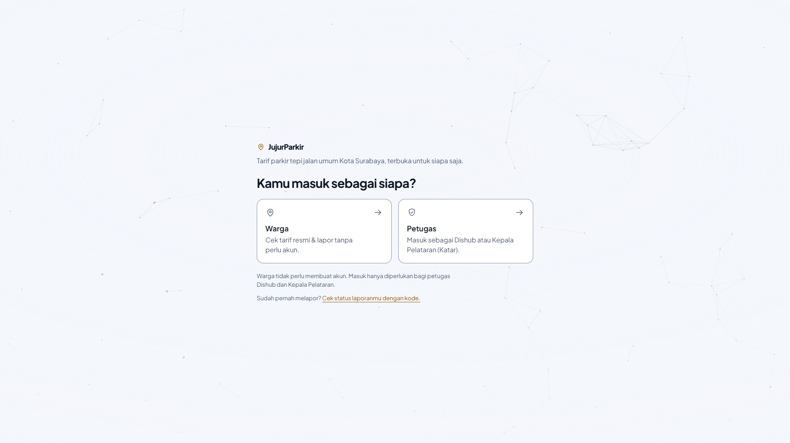
<p><em>Halaman awal — dua pintu masuk: Warga dan Petugas</em></p>

<!-- SCREENSHOT: /warga pada lebar desktop, peta zoom kota penuh, gugus (cluster) pin menyebar di seluruh Surabaya, kotak pencarian terlihat di atas peta -->
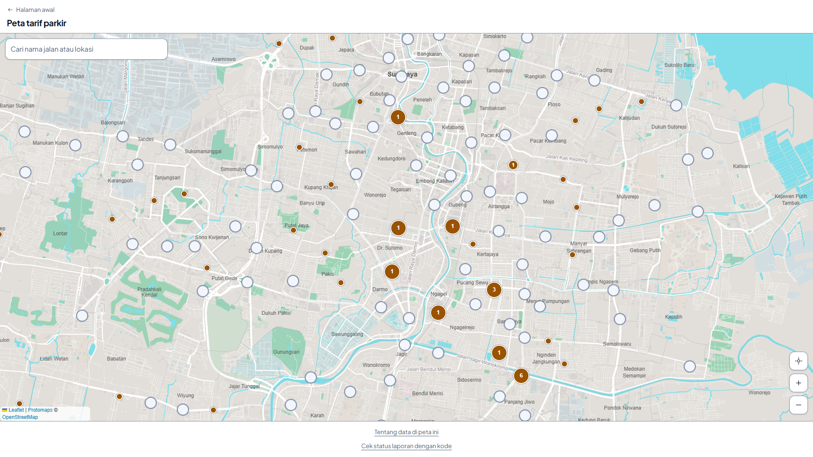
<p><em>Peta warga — 1.235 titik parkir resmi, digugus per area</em></p>

<!-- SCREENSHOT: popup satu titik parkir terbuka pada lebar desktop, memperlihatkan jam jaga, rentang tarif motor dan mobil, keterangan "belum diverifikasi", baris "Sumber: Perda 7/2023", dan jumlah laporan warga -->
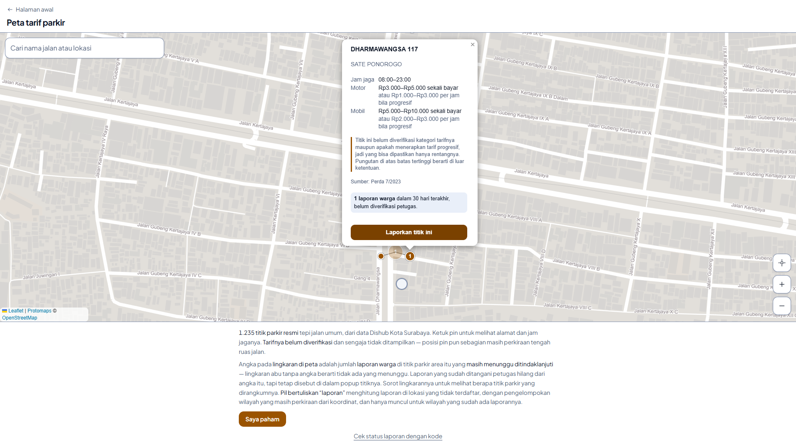
<p><em>Popup titik — tarif rujukan, sumber pasal, dan jumlah laporan warga</em></p>

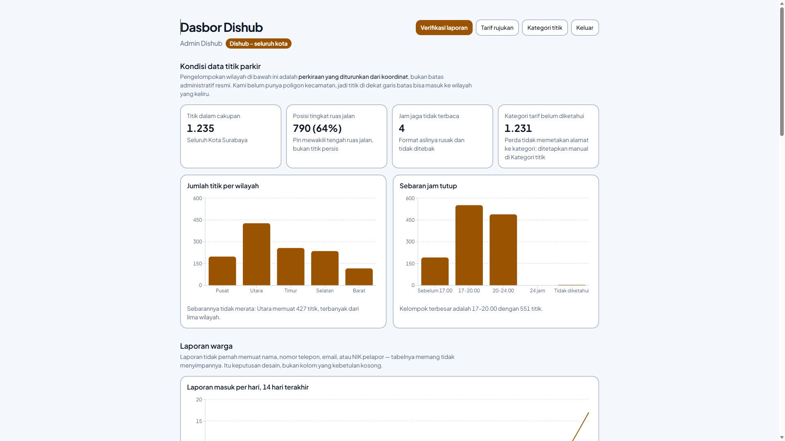
<p><em>Dasbor Dishub (atas) — 1.235 titik dalam cakupan, sebaran wilayah, dan sebaran jam tutup</em></p>


<p><em>Dasbor Dishub (bawah) — grafik laporan harian, penyaring, dan pengubah status per baris</em></p>

<!-- SCREENSHOT: /warga/cek/[kode] pada lebar desktop, memperlihatkan status sebuah laporan beserta tindak lanjut petugas -->
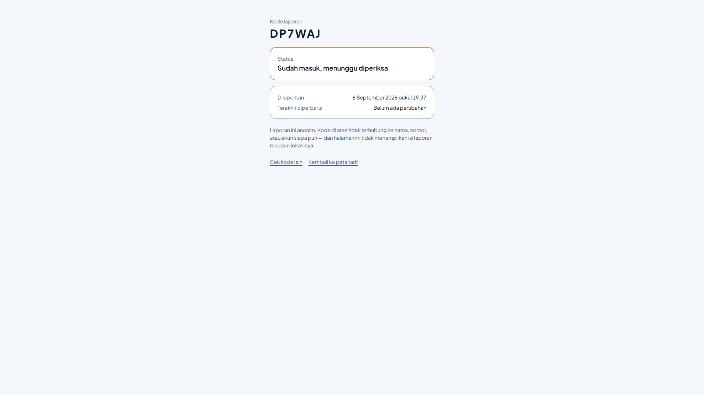
<p><em>Cek status — pelapor anonim tetap bisa menelusuri laporannya lewat kode</em></p>

</div>

#### Tampilan Ponsel (375 px)

<div align="center">

| Warga | | |
|:--:|:--:|:--:|
| 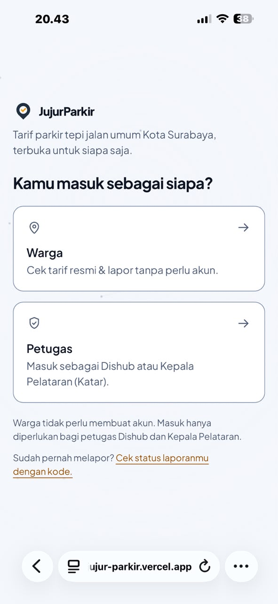 | 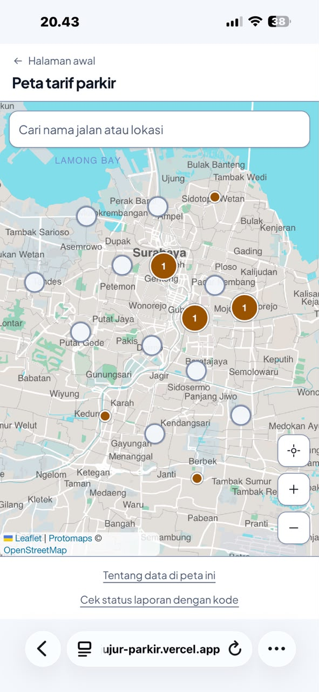 | 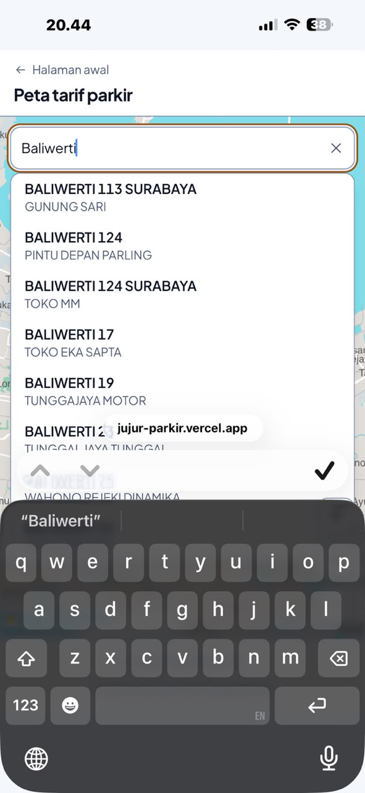 |
| *Halaman awal, dua kartu tersusun menurun* | *Peta + kotak pencarian selebar layar. Atribusi OpenStreetMap tetap terbaca di kiri bawah* | *Saran pencarian per kata, menutupi peta tanpa terpotong di tepi* |
| 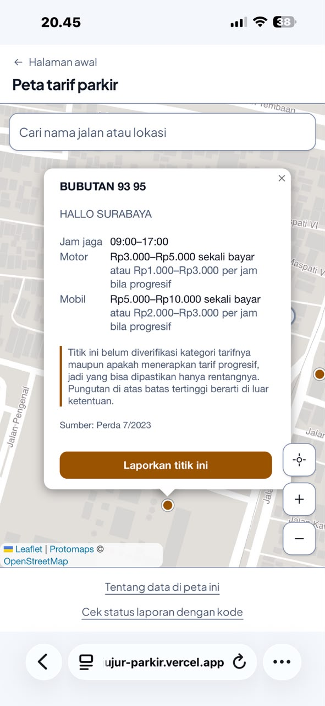 | 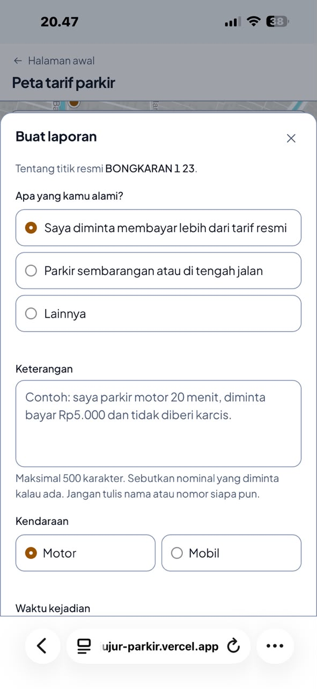 |  |
| *Popup titik, isinya dapat digulir, judul dan tombol tutup tidak terpotong* | *Form laporan (atas), jenis keluhan dan keterangan* | *Form laporan (bawah), kendaraan, waktu, foto opsional, lalu kirim* |

| Petugas | | |
|:--:|:--:|:--:|
| 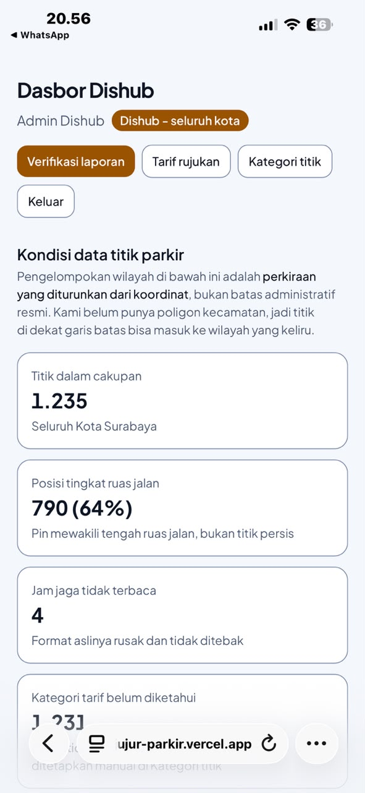 |  |  |
| *Dasbor Dishub (atas), kondisi data titik parkir* | *Grafik berubah jadi daftar angka di layar sempit, bukan grafik yang gagal dirender* | *Laporan warga, grafik harian, penyaring, dan tabel yang dapat digeser mendatar* |

</div>

## 🛠️ Teknologi

### Tech Stack

#### Frontend

```
Framework   : Next.js 16.3.3 (App Router, Turbopack) + React 19.2.8
UI Library  : Tailwind CSS v4 (@tailwindcss/postcss), tanpa component library
State Mgmt  : Hook bawaan React — useState, useActionState, useSyncExternalStore
              (tidak memakai Redux/Zustand: tidak ada state global lintas halaman)
Validation  : Validasi manual di Server Action + CHECK constraint di PostgreSQL
              (tidak memakai Zod: aturan yang menentukan ada di basis data)
Peta        : Leaflet 1.9.4 + protomaps-leaflet 5.1.0 + leaflet.markercluster 1.5.3
Grafik      : Recharts 3.10.1
```

#### Backend

```
Runtime     : Node.js 18+ (runtime Next.js)
Framework   : Tidak ada server terpisah. Logika server berjalan sebagai
              Server Actions Next.js (10 action) + 1 Route Handler
Database    : PostgreSQL + PostGIS, dihosting Supabase
ORM         : Tidak ada. Query lewat supabase-js; aturan ditegakkan
              RLS policy, CHECK constraint, dan grant per kolom
Auth        : Supabase Auth (email + kata sandi) via @supabase/ssr,
              hanya untuk petugas; warga tidak pernah punya akun
Middleware  : src/proxy.ts (nama middleware di Next.js 16)
```

#### DevOps & Tools

```
Deployment  : Vercel
CI/CD       : https://jujur-parkir.vercel.app/
Testing     : Belum ada automated test — lihat bagian Testing
Monitoring  : Belum ada
Linting     : ESLint 9 + eslint-config-next 16.3.3
Bahasa      : TypeScript 5 (strict)
```

### Alasan Pemilihan Teknologi

| Teknologi | Alasan Pemilihan |
|-----------|------------------|
| **Leaflet + PMTiles (protomaps-leaflet)** | Penggunanya sedang berdiri di pinggir jalan dengan sinyal buruk, bukan duduk di depan Wi-Fi. Seluruh peta Surabaya dikemas dalam satu berkas `.pmtiles` 21 MB yang disajikan dari server sendiri dan dibaca sepotong-sepotong lewat HTTP Range, dengan `Cache-Control` satu hari. Tidak ada ketergantungan pada penyedia tile pihak ketiga, tidak ada API key yang bisa kedaluwarsa saat penjurian, dan halaman peta tetap `Static` sehingga bisa dirender tanpa memanggil basis data. |
| **GeoJSON statis untuk geometri titik** | Bila 1.235 titik diambil dari basis data setiap kunjungan, peta berhenti bekerja saat Supabase tidak bisa dihubungi. Dengan geometri statis, yang hilang saat jaringan bermasalah hanyalah angka laporan — petanya sendiri tetap tergambar penuh. Harga yang dibayar disebutkan terus terang di Batasan Sistem. |
| **Supabase Row Level Security** | Pembatasan wilayah Katar adalah aturan keamanan, bukan pilihan tampilan. Menyaringnya di klien berarti seluruh data tetap terkirim dan hanya disembunyikan. Dengan RLS, Katar yang memanggil endpoint langsung dari konsol peramban tetap ditolak Postgres. Penegakannya berada satu lapis di bawah kode aplikasi, sehingga bug di antarmuka tidak bisa membocorkan data. |
| **Grant per kolom di PostgreSQL** | RLS menjawab "baris mana yang boleh disentuh", bukan "kolom mana yang boleh diisi". Tanpa grant per kolom, pemegang kunci anon bisa mengisi `status` dan `tindak_lanjut` saat mengirim laporan — dan `tindak_lanjut` adalah teks yang ditampilkan ke publik sebagai jawaban petugas. Grant kolom menutup kemungkinan aplikasi ini menerbitkan jawaban resmi palsu. |
| **Server Actions, bukan REST API terpisah** | Setiap tulisan ke basis data hanya punya satu jalan masuk yang sudah membawa sesi penggunanya. Tidak ada endpoint publik yang perlu diberi autentikasi sendiri, dan tidak ada duplikasi validasi antara handler API dan pemanggilnya. |
| **PostGIS `geography(Point, 4326)`** | Lokasi laporan Jalur B disimpan sebagai geometri sungguhan, bukan dua kolom angka. Ini yang memungkinkan indeks GiST dan perhitungan jarak dilakukan basis data bila nanti diperlukan, tanpa mengubah skema. |
| **Recharts** | Dasbor butuh tiga grafik sederhana yang responsif dan bisa dirender di React tanpa canvas manual. Animasi dimatikan agar grafik langsung terbaca dan tidak menyita CPU pada ponsel kelas menengah. |
| **Tailwind CSS v4 tanpa component library** | Seluruh warna melalui token yang dicek kontrasnya terhadap WCAG AA. Component library akan membawa palet dan tipografinya sendiri, dan menyamakannya justru lebih mahal daripada menulis komponennya sendiri. |
| **Tanpa dependensi pencarian (fuzzy search)** | Untuk 1.235 baris, penyaringan per kata selesai dalam hitungan milidetik. Menambah pustaka berarti menambah berkas yang harus diunduh warga di jaringan yang sudah lambat, demi manfaat yang tidak terukur. |

### Dependencies Utama

```json
{
  "dependencies": {
    "next": "16.3.3",
    "react": "19.2.8",
    "react-dom": "19.2.8",
    "@supabase/ssr": "^0.12.5",
    "@supabase/supabase-js": "^2.112.4",
    "leaflet": "^1.9.4",
    "protomaps-leaflet": "^5.1.0",
    "leaflet.markercluster": "^1.5.3",
    "recharts": "^3.10.1"
  }
}
```

### Metode Pengembangan

Pengembangan berjalan dalam empat tahap yang berurutan, dan tiap tahap meninggalkan berkas yang bisa diperiksa ulang.

1. **Pengumpulan data.** `scraping/scraping_alamat.py` menelusuri dashboard data titik parkir Dishub Kota Surabaya menggunakan Selenium, menyusuri 136 halaman tabel, dan menyimpan alamat, nama lokasi, serta jam jaga ke CSV.
2. **Geocoding.** `scraping/scraping_latitude.py` mengubah alamat menjadi koordinat memakai Nominatim (OpenStreetMap) lewat geopy, dengan rate limiter dan pencarian dibatasi kotak wilayah Surabaya. Singkatan nama jalan dipetakan lebih dulu ke nama lengkap agar tingkat keberhasilannya naik.
3. **Pelabelan presisi.** `scripts/build-titik.mjs` menandai setiap titik dengan tingkat presisinya. Aturannya berbasis bukti, bukan asumsi: bila satu koordinat dipakai lebih dari satu alamat, koordinat itu jelas mewakili ruas jalan dan diberi label `jalan`; bila hanya dipakai satu alamat, labelnya `perkiraan`. Nilai `exact` **tidak pernah ditulis** karena tidak ada bukti dalam data ini yang mendukungnya. Skrip yang sama menolak berjalan bila menemukan koordinat di luar kotak Surabaya atau tabrakan hash `kode_titik`.
4. **Verifikasi terhadap Perda.** Angka tarif tidak ditulis sebagai konstanta di dalam kode. Semuanya disimpan di tabel `tarif`, yang kolom `sumber`-nya `NOT NULL` — sehingga secara teknis tidak mungkin menyimpan angka tanpa menyebut asalnya [6]. Selama tabel itu kosong, peta menampilkan keterangan bahwa tarif belum diverifikasi, bukan angka bawaan.

Skema basis data dikembangkan sebagai 14 migrasi berurutan yang seluruhnya tersimpan di `supabase/migrations/`, sehingga riwayat setiap perubahan aturan keamanan bisa ditelusuri.

---

## 🏗️ Arsitektur Sistem

### System Architecture

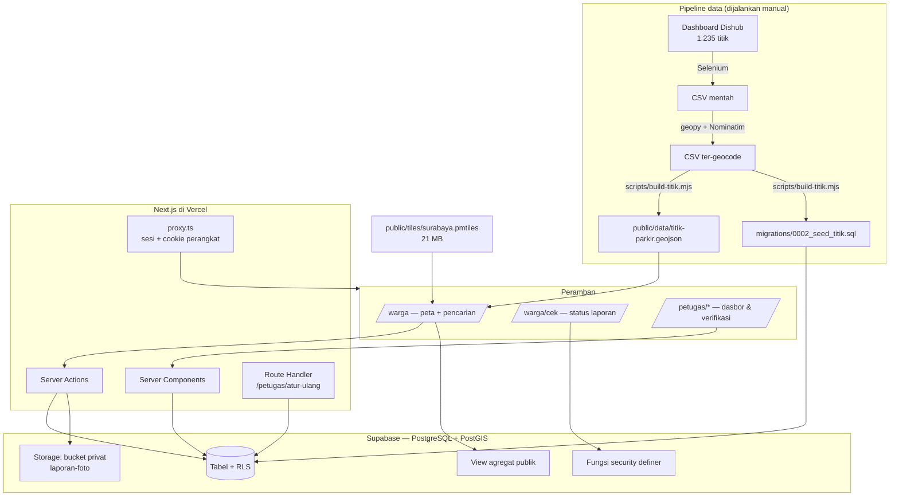

### Database Schema

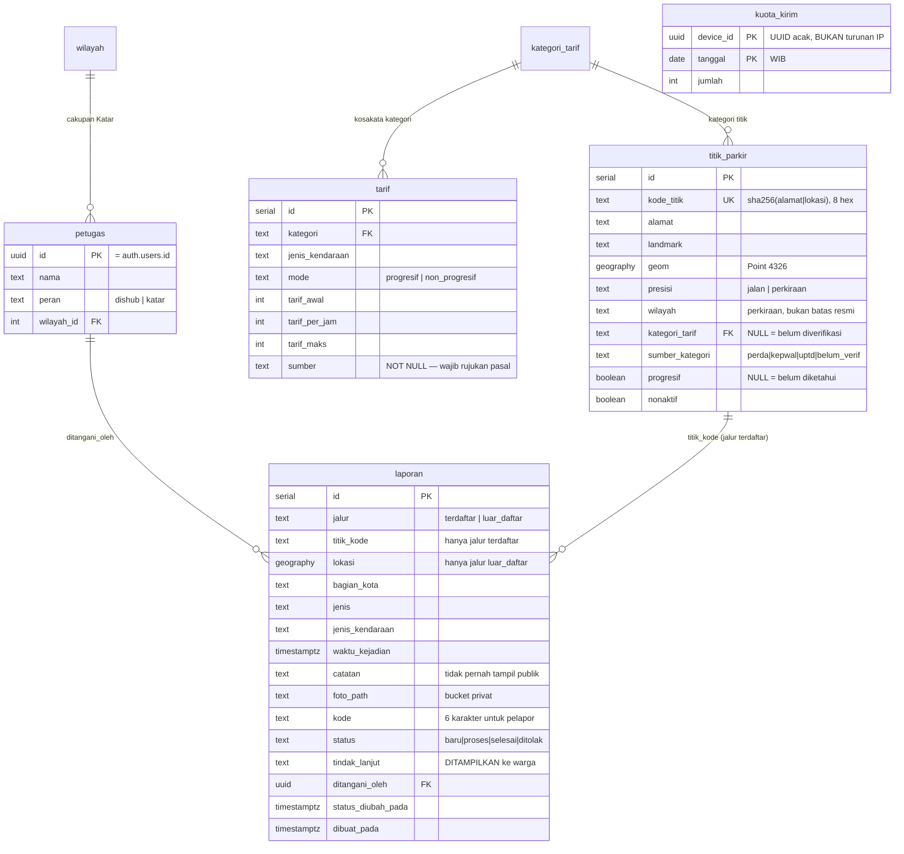

**Catatan penting soal `kuota_kirim`:** tabel ini **sengaja tidak punya relasi apa pun** ke tabel `laporan`. Bila ada, siapa pun yang bisa membaca keduanya dapat menyusun daftar "laporan-laporan ini dikirim dari perangkat yang sama" — itu pelacakan pelapor. Yang tersimpan hanya *berapa*, tidak pernah *apa*.

**Objek basis data lainnya:**

| Objek | Jenis | Fungsi |
|-------|-------|--------|
| `laporan_agregat_titik` | View (`security_invoker = false`) | Jumlah laporan 30 hari per titik, tanpa `ditolak`. Bisa dibaca kunci anon — angkanya saja, bukan barisnya |
| `laporan_agregat_wilayah` | View (`security_invoker = false`) | Sama, per wilayah, untuk laporan di luar daftar |
| `laporan_petugas` | View (`security_invoker = true`) | Laporan untuk petugas; RLS tabel induk tetap berlaku di atasnya |
| `cek_status_laporan(text)` | Function (security definer) | Mengembalikan hanya status, tindak lanjut, dan dua stempel waktu untuk satu kode |
| `pakai_kuota(uuid)` | Function (security definer) | Memeriksa dan menaikkan hitungan kiriman dalam satu pernyataan atomik |
| `batal_kuota(uuid)` | Function (security definer) | Mengembalikan jatah bila penyimpanan laporan gagal setelah kuota terpakai |

> Tabel `kuota` pada migrasi `0001` (berbasis hash IP) **tidak dipakai**; ia digantikan `kuota_kirim` pada migrasi `0014` yang memakai UUID acak dan tidak menyentuh IP sama sekali. Tabel lama sengaja tidak dihapus agar riwayat migrasi tetap utuh.

### Folder Structure

```
parkir-surabaya/
├── src/
│   ├── app/
│   │   ├── page.tsx                    # Halaman awal, dua kartu
│   │   ├── layout.tsx
│   │   ├── globals.css                 # Token warna + gaya Leaflet
│   │   ├── warga/
│   │   │   ├── page.tsx                # Peta (Static)
│   │   │   ├── actions.ts              # kirimLaporan
│   │   │   └── cek/
│   │   │       ├── page.tsx            # Form cek kode
│   │   │       ├── form-cek.tsx
│   │   │       └── [kode]/page.tsx     # Hasil cek status
│   │   └── petugas/
│   │       ├── page.tsx                # Login
│   │       ├── actions.ts              # masuk, keluar, atur ulang sandi
│   │       ├── atur-ulang/route.ts     # Route Handler satu-satunya
│   │       ├── sandi-baru/
│   │       ├── dasbor/                 # Grafik, penyaring, ubah status
│   │       ├── laporan/                # Verifikasi + peta laporan + foto
│   │       ├── tarif/                  # CRUD tarif rujukan
│   │       └── titik/                  # Penetapan kategori per titik
│   ├── components/
│   │   ├── peta-tarif.tsx              # Peta warga + gugus + popup
│   │   ├── cari-titik.tsx              # Pencarian dalam memori
│   │   ├── lapor-warga.tsx             # Form laporan (Jalur A & B)
│   │   ├── peta-laporan.tsx            # Peta verifikasi petugas
│   │   ├── catatan-peta.tsx
│   │   └── particle-network.tsx        # Latar halaman awal
│   ├── lib/
│   │   ├── auth.ts                     # getPetugas() — satu pintu identitas
│   │   ├── peta-dasar.ts               # Batas zoom, bounding box, PMTiles
│   │   ├── tarif.ts                    # Perhitungan rentang tarif
│   │   ├── laporan.ts                  # Kosakata status & label
│   │   ├── perangkat.ts                # Cookie perangkat bertanda tangan
│   │   ├── wilayah-titik.ts            # Perkiraan wilayah dari koordinat
│   │   ├── galat.ts                    # Penerjemah galat PostgreSQL
│   │   ├── riwayat-kode.ts             # Riwayat kode di localStorage
│   │   └── supabase/{client,server}.ts
│   └── proxy.ts                        # Middleware Next.js 16
├── supabase/migrations/                # 0001 – 0014
├── scripts/
│   ├── build-titik.mjs                 # CSV → GeoJSON + SQL seed
│   ├── seed-petugas.mjs                # Akun petugas (service role)
│   └── seed-tarif.mjs                  # Baris tarif awal
├── scraping/
│   ├── scraping_alamat.py              # Selenium → CSV
│   └── scraping_latitude.py            # geopy/Nominatim → koordinat
├── public/
│   ├── data/titik-parkir.geojson       # 1.235 titik
│   └── tiles/surabaya.pmtiles          # Peta vektor 21 MB
└── data/raw/                           # CSV mentah (tidak di-commit)
```

---

## 🔒 Keamanan & Privasi

Aplikasi ini menerima laporan dugaan pelanggaran dari warga terhadap petugas parkir. Bila identitas pelapor bisa tersimpul, aplikasinya berhenti menjadi alat transparansi dan berubah menjadi risiko bagi orang yang memakainya. Karena itu privasi diperlakukan sebagai persyaratan, bukan fitur tambahan.

### Anonimitas pelapor

- Tabel `laporan` **tidak memiliki kolom** nama, nomor telepon, email, NIK, alamat IP, maupun user agent. Anonimitas dijaga dengan tidak pernah mengambil datanya sejak awal, bukan dengan menghapusnya belakangan.
- Warga tidak pernah membuat akun. Autentikasi hanya ada di sisi petugas.
- Satu-satunya pegangan pelapor adalah kode acak 6 karakter, yang tidak terhubung ke identitas apa pun.
- `cek_status_laporan()` mengembalikan hanya empat kolom, dan tidak membedakan kode yang tidak pernah ada dari kode yang sudah dihapus — agar halaman itu tidak bisa dipakai memetakan laporan orang lain.

### Metadata foto

Foto dari galeri ponsel hampir selalu membawa metadata EXIF, dan di dalamnya sering ada koordinat GPS pengambilan gambar — yang bisa saja rumah pelapor. Sebelum diunggah, foto **digambar ulang ke elemen `<canvas>` lalu di-encode ulang menjadi JPEG**. Proses ini membuang seluruh blok metadata, bukan sekadar menyembunyikannya. Ukurannya sekaligus diperkecil.

### Penyimpanan foto

- Bucket `laporan-foto` dibuat **privat** (`public = false`) dan tidak pernah dijadikan publik.
- Tidak ada policy `SELECT` untuk peran anon — pengirim sendiri pun tidak bisa mengunduh kembali berkas yang baru diunggahnya.
- Petugas membukanya lewat **signed URL berumur 60 detik**, diterbitkan hanya ketika ia menekan tombol "Lihat foto". Foto tidak pernah ikut termuat bersama halaman: memuat otomatis berarti setiap petugas yang membuka sebuah laporan ikut melihat wajah orang yang kebetulan lewat, tanpa pernah memilih untuk melihatnya.
- Bucket dibatasi 10 MB dan hanya menerima `image/jpeg` di tingkat penyimpanan, bukan hanya di aplikasi.

### Penegakan di basis data

- **RLS aktif** pada seluruh tabel data. Cakupan wilayah Katar ditegakkan policy Postgres; permintaan langsung dari konsol peramban tetap ditolak.
- **Grant per kolom.** Peran anon hanya boleh mengisi 10 kolom saat mengirim laporan; `status`, `tindak_lanjut`, `ditangani_oleh`, dan `status_diubah_pada` tidak termasuk. Tanpa ini, siapa pun bisa menerbitkan kalimat yang terbaca sebagai jawaban resmi Dishub di halaman cek status. Peran authenticated hanya boleh mengubah empat kolom itu, tidak lebih.
- **View agregat** dibuat `security_invoker = false` dan hanya mengeluarkan hitungan, sehingga kunci publik bisa membaca angkanya tanpa bisa membaca satu baris laporan pun.
- **Dasbor tidak pernah menarik teks bebas.** Kolom `catatan` dan `foto_path` sengaja tidak diikutkan dalam query dasbor.

### Penahan penyalahgunaan

- Kolom jebakan (*honeypot*) tersembunyi pada form; kiriman yang mengisinya ditolak diam-diam.
- Jeda 30 detik antar kiriman di sisi klien.
- Kuota 3 laporan per perangkat per hari, ditegakkan **di basis data** lewat fungsi atomik, bukan di peramban. Penanda perangkat adalah UUID acak dalam cookie `httpOnly` bertanda tangan HMAC — tidak diturunkan dari IP, user agent, atau sidik jari peramban apa pun.
- Koordinat laporan Jalur B ditolak bila berada di luar kotak Kota Surabaya.

### Autentikasi petugas

Identitas dibaca lewat `getUser()`, bukan `getSession()` — yang terakhir hanya membaca cookie apa adanya tanpa memverifikasi tanda tangan JWT, sehingga isinya bisa dipalsukan dan tidak layak dipakai untuk otorisasi. Kunci `service_role` **tidak pernah** masuk ke kode aplikasi; ia hanya dipakai dua skrip seeder yang berjalan di Node.

### Penggunaan AI dalam pengembangan

Sesuai Ketentuan Peserta nomor 7, penggunaan AI kami nyatakan terbuka.

Sebagian penulisan kode, penyusunan skema basis data, penelusuran bug, dan penyusunan dokumen README ini dikerjakan dengan bantuan asisten AI (Claude). Bantuan itu dipakai sebagai alat bantu penulisan dan peninjauan, bukan sebagai pengganti keputusan tim.

Yang tetap menjadi tanggung jawab tim sepenuhnya: pemilihan masalah dan sumber data, keputusan arsitektur dan model privasi, verifikasi bahwa setiap angka tarif memiliki rujukan Perda, pengujian manual seluruh alur, serta kebenaran seluruh isi dokumen ini. Setiap keluaran AI ditinjau, diuji, dan disunting sebelum dipakai. Tidak ada bagian aplikasi yang dikirimkan tanpa dibaca dan diverifikasi anggota tim.

---

## ⚠️ Batasan Sistem

Bagian ini ditulis apa adanya. Aplikasi yang menyatakan batasnya lebih bisa dipercaya daripada aplikasi yang berpura-pura tidak punya.

### Batasan data

1. **Warga tidak dapat menambah titik parkir baru.** Registri titik hanya berasal dari data Dishub Kota Surabaya melalui pipeline. Tidak ada antarmuka penambahan titik bagi siapa pun — termasuk petugas. Alasannya bukan teknis: menambah titik berarti menyatakan "lokasi ini resmi", dan pernyataan itu hanya boleh dibuat oleh yang berwenang menetapkannya. Lokasi yang terlewat tetap terekam melalui laporan Jalur B.

2. **Koordinat berasal dari geocoding otomatis, bukan survei lapangan.** Dari 1.235 baris hanya terdapat **688 koordinat unik**. Artinya sekitar **44% baris berbagi koordinat** dengan alamat lain — geocoder jatuh ke titik tengah ruas jalan, bukan nomor rumah. Aplikasi menandai hal ini pada setiap popup, dan tidak pernah mengklaim presisi `exact`. Rincian label: 790 titik berlabel `jalan` (koordinatnya terbukti mewakili ruas jalan karena dipakai lebih dari satu alamat) dan 445 berlabel `perkiraan`.

3. **Kategori tarif per titik belum diketahui.** Perda 7/2023 tidak memetakan alamat ke kategori tarif [6]. Karena itu aplikasi menampilkan **rentang tarif resmi**, bukan satu angka pasti, untuk titik yang kategorinya belum ditetapkan. Penyempitan menjadi satu angka hanya terjadi bila petugas menetapkan kategorinya **dan** menyebutkan dasar hukumnya.

4. **Pembagian wilayah adalah perkiraan.** Lima wilayah (Pusat/Utara/Timur/Selatan/Barat) diturunkan dari koordinat memakai ambang jarak kasar terhadap titik pusat kota, **bukan batas administratif resmi kecamatan**. Titik di dekat garis batas hampir pasti salah masuk. Karena wilayah inilah yang menentukan cakupan Katar, kesalahan pembagian dapat membuat sebuah laporan tampil pada Katar yang keliru. Setiap tampilan yang memakai nilai ini menyebutkan sifat perkiraannya.

5. **Jam jaga tidak selalu terbaca.** Sebagian nilai jam pada data sumber tidak mengikuti format yang konsisten; popup menampilkan teks aslinya dan menyatakan bahwa formatnya belum terbaca, alih-alih menebak.

### Batasan fungsional

6. **Aplikasi tidak memverifikasi kebenaran laporan.** Laporan adalah keterangan sepihak warga, **bukan putusan pelanggaran**. Angka laporan yang tampil di peta selalu disertai keterangan "belum diverifikasi petugas". Tanpa kalimat itu, angka telanjang di sebelah sebuah titik akan terbaca sebagai vonis bagi juru parkir di sana.

7. **Batas kirim laporan berbasis cookie perangkat dan dapat ditembus.** Pengguna yang sengaja menghapus cookie atau membuka mode penyamaran akan mendapat penanda baru berikut kuota baru. Tanda tangan HMAC hanya menutup jalur termudah, yaitu menyunting isi cookie di DevTools. Ini **penahan spam iseng, bukan sistem anti-abuse**. Menegakkannya lebih keras menuntut akun atau sidik jari perangkat — keduanya justru yang tidak boleh ada pada alur pelaporan anonim.

8. **Titik baru tidak muncul otomatis di peta warga.** Geometri dibaca dari GeoJSON statis, sedangkan basis data hanya menyediakan atributnya. Perubahan registri baru terlihat setelah pipeline dijalankan ulang dan aplikasi di-deploy ulang. Ini konsekuensi yang diterima secara sadar agar peta tetap tergambar penuh tanpa jaringan ke basis data.

9. **Kode laporan belum dijamin unik oleh basis data.** Indeks pada kolom `kode` belum bersifat `UNIQUE`, sehingga secara teoretis dua laporan dapat memiliki kode sama dan halaman cek status akan menampilkan yang pertama. Peluangnya kecil (6 karakter dari alfabet 31 huruf), tetapi belum tertutup secara struktural.

10. **Foto laporan tidak dapat dilihat warga,** hanya petugas. Tidak ada pratinjau bagi pengirim setelah unggahan selesai.

11. **Belum ada notifikasi.** Warga harus membuka halaman cek status secara manual; tidak ada email atau push notification — konsekuensi langsung dari pilihan anonim tanpa akun.

### Batasan teknis

12. **Belum ada automated test.** Lihat bagian [Testing](#-testing).

13. **Peta tidak berfungsi tanpa JavaScript.** Halaman `/warga` memerlukan JavaScript aktif. Sebagai jalur setara, keterangan peta dan tautan cek status tetap dirender sebagai HTML biasa di bawah peta.

14. **Berkas peta 21 MB.** Kunjungan pertama mengunduh potongan yang diperlukan saja lewat HTTP Range, tetapi pada jaringan sangat lambat pemuatan awal tetap terasa. Cache satu hari mengurangi hal ini untuk kunjungan berikutnya.

15. **Aplikasi belum diuji pada peramban selain Chromium dan Firefox versi terkini.**

---

## 🚀 Instalasi & Setup

### Prerequisites

Pastikan Anda telah menginstall:

- **Node.js** (v18.x atau lebih tinggi)
- **npm** (atau yarn / pnpm)
- **Akun Supabase** dengan sebuah project PostgreSQL (ekstensi **PostGIS** harus diaktifkan)
- **Git**
- *(opsional, hanya untuk menjalankan ulang pipeline data)* **Python 3** beserta `selenium`, `pandas`, dan `geopy`

### Langkah Instalasi

#### 1. Clone Repository

```bash
git clone https://github.com/reyhanamando35/JujurParkir.git
cd JujurParkir
```

#### 2. Install Dependencies

```bash
npm install
```

#### 3. Setup Environment Variables

Buat berkas `.env.local` di root direktori:

```env
# Supabase — dapat dilihat di Project Settings > API
NEXT_PUBLIC_SUPABASE_URL="https://[project-ref].supabase.co"
NEXT_PUBLIC_SUPABASE_ANON_KEY="[anon_key]"

# Hanya dipakai skrip seeder di scripts/. JANGAN dipakai di dalam src/.
SUPABASE_SERVICE_ROLE_KEY="[service_role_key]"

# Kunci HMAC untuk menandatangani cookie penanda perangkat (batas kirim harian).
# Buat dengan:
#   node -e "console.log(require('node:crypto').randomBytes(32).toString('base64url'))"
# WAJIB diisi di produksi, dan harus berbeda dari nilai lokal.
KUOTA_RAHASIA="[nilai_acak_minimal_16_karakter]"
```

> **Bila `KUOTA_RAHASIA` tidak diisi**, aplikasi tetap berjalan dan laporan tetap dapat dikirim, tetapi batas 3 laporan per hari **tidak akan aktif** dan server mencatat peringatan di log. Perilaku ini dipilih dengan sadar: warga yang tidak bisa melapor karena kesalahan konfigurasi adalah kegagalan yang lebih buruk daripada batas yang tidak berjalan.

#### 4. Setup Database

Proyek ini tidak memakai ORM, sehingga tidak ada perintah `db:migrate`. Migrasi dijalankan lewat **SQL Editor** pada dashboard Supabase.

```
Jalankan berkas di supabase/migrations/ SECARA BERURUTAN:

  0001_init.sql                 skema awal + RLS
  0002_seed_titik.sql           1.235 titik parkir  (dibangkitkan otomatis)
  0003_wilayah_rls.sql          lima wilayah + cakupan Katar
  0004_laporan_warga.sql        kolom laporan + bucket foto
  0005_agregat_publik.sql       perbaikan view agregat
  0006_verifikasi_laporan.sql   view petugas + cek status warga
  0007_agregat_terbuka.sql      agregat terbuka/total
  0008_tarif_kelola.sql         policy tulis tabel tarif
  0009_kategori_tarif.sql       tabel referensi kategori
  0010_kategori_tanpa_progresif.sql
  0011_atribut_titik.sql        penetapan atribut per titik
  0012_insert_anon_kolom.sql    grant per kolom untuk anon
  0013_batas_bucket_foto.sql    batas ukuran & tipe berkas
  0014_kuota_kirim.sql          batas kirim harian
```

Seed opsional (memerlukan `SUPABASE_SERVICE_ROLE_KEY`):

```bash
node scripts/seed-petugas.mjs   # membuat akun petugas contoh
node scripts/seed-tarif.mjs     # mengisi baris tarif rujukan
```

Membangun ulang data titik dari CSV mentah (opsional, hanya bila datanya diperbarui):

```bash
node scripts/build-titik.mjs
```

#### 5. Run Development Server

```bash
npm run dev
```

Aplikasi akan berjalan di `http://localhost:3000`

---

## 📘 Penggunaan

### Menjalankan Aplikasi

```bash
# Development mode
npm run dev

# Production build
npm run build
npm run start

# Linting
npm run lint
```

> Perintah `npm run test` **belum tersedia** — lihat bagian [Testing](#-testing).

### User Guide

#### Untuk Warga (tanpa akun)

1. **Buka peta** — kunjungi `/warga`. Tidak ada registrasi dan tidak ada login; halaman langsung menampilkan seluruh titik parkir resmi.
2. **Cari lokasi** — ketik nama jalan atau nama lokasi pada kotak pencarian di atas peta (minimal 2 karakter). Gunakan tombol panah atas/bawah untuk menyusuri saran, `Enter` untuk memilih, `Escape` untuk menutup. Peta akan terbang ke titik itu dan membuka popupnya.
3. **Baca tarif** — popup menampilkan jam jaga, rentang tarif motor dan mobil, apakah kategori titik itu sudah diverifikasi, sumber pasalnya, dan berapa laporan warga yang masuk 30 hari terakhir.
4. **Kirim laporan** — tekan tombol lapor pada popup untuk melaporkan titik terdaftar (Jalur A), atau gunakan alur "lokasi tidak terdaftar" lalu geser pin ke posisi sebenarnya (Jalur B). Isi jenis keluhan, jenis kendaraan, waktu kejadian, dan keterangan; foto bersifat opsional.
5. **Catat kode laporan** — setelah terkirim, sebuah kode 6 karakter ditampilkan. **Catat kode ini** — karena laporan anonim, tidak ada email atau nomor untuk mengirimkannya ulang bila hilang.
6. **Cek status** — buka `/warga/cek`, masukkan kode, atau pilih dari riwayat yang tersimpan di peramban Anda.

#### Untuk Petugas (Dishub / Katar)

1. **Akses panel** — buka `/petugas`, masuk dengan email dinas dan kata sandi. Peran ditentukan otomatis dari akun; tidak ada pilihan peran di form. Lupa kata sandi ditangani lewat tautan atur ulang yang dikirim ke email.
2. **Dasbor** — `/petugas/dasbor` menampilkan grafik laporan harian 14 hari, sebaran wilayah, sebaran jam tutup, dan tabel laporan. Gunakan penyaring **Semua / Titik terdaftar / Di luar daftar / Sudah diverifikasi**. Laporan di luar daftar dilengkapi koordinat serta tiga titik resmi terdekat beserta jaraknya, sebagai pengganti alamat.
3. **Ubah status laporan** — pilih status baru pada baris tabel. Status **Terverifikasi** dan **Ditolak** mewajibkan pengisian tindak lanjut, karena teks itulah yang dibaca warga di halaman cek status. Sistem mencatat siapa yang mengubah dan kapan.
4. **Verifikasi mendalam** — `/petugas/laporan` menampilkan peta laporan, pencarian, panel verifikasi, dan tombol "Lihat foto" bila laporan menyertakan foto.
5. **Kelola tarif** *(khusus Dishub)* — `/petugas/tarif` untuk menambah, mengubah, dan menghapus baris tarif. Kolom sumber wajib diisi rujukan pasal. Penghapusan memerlukan konfirmasi dua langkah.
6. **Tetapkan kategori titik** *(khusus Dishub)* — `/petugas/titik` untuk menetapkan kategori tarif dan mode bayar sebuah titik beserta dasar hukumnya.

---

## 🔌 API Documentation

Proyek ini **tidak mengekspos REST API publik**. Seluruh operasi tulis berjalan melalui **Server Actions** Next.js, yang dipanggil langsung dari komponen dan sudah membawa sesi penggunanya. Pilihan ini disengaja: tidak ada endpoint terbuka yang perlu diberi lapisan autentikasi sendiri, dan tidak ada duplikasi validasi.

### Base URL

```
Development : http://localhost:3000
Production  : https://jujur-parkir.vercel.app/
```

### Route Handler

Hanya ada satu, dan keberadaannya wajib karena menukar kode menjadi sesi berarti **menulis cookie** — sesuatu yang tidak boleh dilakukan Server Component.

```http
GET /petugas/atur-ulang?code=[kode_dari_email]
    → 302 /petugas/sandi-baru              (kode sah)
    → 302 /petugas?atur_ulang=tanpa_kode   (tanpa parameter code)
    → 302 /petugas?atur_ulang=kedaluwarsa  (kode kedaluwarsa / sudah dipakai)
```

### Server Actions

| Action | Berkas | Peran | Fungsi |
|--------|--------|-------|--------|
| `kirimLaporan` | `app/warga/actions.ts` | anon | Validasi, cek kuota, unggah foto, simpan laporan, kembalikan kode |
| `masuk` | `app/petugas/actions.ts` | anon | Login petugas |
| `keluar` | `app/petugas/actions.ts` | authenticated | Logout |
| `kirimTautanAturUlang` | `app/petugas/actions.ts` | anon | Kirim email atur ulang kata sandi |
| `simpanKataSandiBaru` | `app/petugas/actions.ts` | authenticated | Simpan kata sandi baru |
| `ubahStatusLaporan` | `app/petugas/laporan/actions.ts` | dishub / katar | Ubah status + tindak lanjut; catat pengubah dan waktunya |
| `lihatFotoLaporan` | `app/petugas/laporan/actions.ts` | dishub / katar | Terbitkan signed URL foto berumur 60 detik |
| `simpanTarif` | `app/petugas/tarif/actions.ts` | dishub | Tambah / ubah baris tarif |
| `hapusTarif` | `app/petugas/tarif/actions.ts` | dishub | Hapus baris tarif |
| `simpanAtributTitik` | `app/petugas/titik/actions.ts` | dishub | Tetapkan kategori & mode bayar satu titik |

### Fungsi Basis Data yang Dipanggil Aplikasi

```sql
-- Cek status laporan oleh warga. Security definer; hanya empat kolom keluar.
select * from cek_status_laporan('ZSCKB4');
-- → status, tindak_lanjut, dibuat_pada, status_diubah_pada

-- Kuota kirim harian. Memeriksa dan menaikkan dalam satu pernyataan atomik.
select * from pakai_kuota('6a013198-19e3-4d79-aec8-6bf25513ac87'::uuid);
-- → diizinkan, terpakai, sisa, reset_pada

-- Mengembalikan jatah bila penyimpanan laporan gagal setelah kuota terpakai.
select batal_kuota('6a013198-19e3-4d79-aec8-6bf25513ac87'::uuid);
```

### Contoh: membaca agregat publik

View agregat sengaja dapat dibaca kunci anon — inilah wujud transparansinya. Tabel `laporan` sendiri tetap tertutup rapat.

```javascript
// Angka laporan per titik, 30 hari terakhir. BISA dibaca kunci publik.
const { data } = await supabase
  .from("laporan_agregat_titik")
  .select("titik_kode, jumlah_terbuka, jumlah_total");

// Sedangkan ini SELALU mengembalikan array kosong dengan kunci anon,
// karena tabel laporan tidak punya satu pun policy SELECT untuk anon.
const { data: kosong } = await supabase.from("laporan").select("*");
```

---

## 🧪 Testing

### Status Pengujian

Proyek ini **belum memiliki automated test**. Tidak ada Jest, Vitest, maupun Playwright pada `package.json`, dan tidak ada skrip `npm run test`. Kami menuliskannya terus terang alih-alih mencantumkan angka coverage yang tidak ada dasarnya.

Perintah yang benar-benar tersedia:

```bash
npm run lint     # ESLint 9 + eslint-config-next
npm run build    # sekaligus menjalankan type-check TypeScript
```

### Pengujian yang Dilakukan

Verifikasi dilakukan secara manual dan terarah pada titik yang paling mungkin gagal.

| Area | Cara diuji | Hasil |
|------|-----------|-------|
| Type safety & lint | `npx tsc --noEmit`, `npm run lint`, `npm run build` pada setiap perubahan | Bersih, tanpa error maupun warning |
| Status render halaman | Keluaran `next build` diperiksa | `/warga` tetap `○ (Static)` — syarat agar peta dapat dirender tanpa memanggil basis data |
| Pencarian titik | Kueri diuji langsung terhadap DOM di lebar 375 / 768 / 1280 px | `baliwerti 124` → 2 hasil; `contong 15` → menemukan "ALON ALON CONTONG 11 - 15"; spasi ganda dan huruf besar-kecil diabaikan; maksimal 8 saran; 1 karakter tidak memunculkan daftar |
| Aksesibilitas pencarian | Navigasi papan ketik diuji lewat event sintetis | `ArrowDown`/`ArrowUp` memindahkan `aria-activedescendant` dan kembali dengan benar; `Escape` menutup daftar; item tersorot memakai latar aksen penuh, bukan perubahan warna tipis |
| Responsif | Diukur pada 375 / 768 / 1280 px | Tidak ada horizontal scroll; target sentuh saran 57 px (di atas syarat 44 px); daftar saran tidak pernah menutupi atribusi OpenStreetMap |
| Popup peta | Diuji pada tinggi peta 488 px | Isi popup dibatasi dan dapat digulir; seluruh popup tetap muat di dalam area peta |
| Cookie perangkat | Diuji lewat permintaan HTTP langsung | Cookie `httpOnly` terpasang pada kunjungan pertama; cookie sah tidak dipasang ulang; tanda tangan yang disunting **ditolak**; UUID yang ditukar dengan tanda tangan lama juga **ditolak** |
| Kontras warna | Seluruh pasangan token diperiksa terhadap WCAG AA | Lolos, termasuk pasangan teks redup di atas permukaan |
| Alur laporan | Dijalankan manual pada Jalur A dan Jalur B | Kode laporan terbit; laporan muncul di dasbor petugas; status berubah dan terbaca warga di halaman cek status |
| RLS | Diperiksa dengan membaca tabel `laporan` memakai kunci anon | Selalu mengembalikan array kosong, sementara view agregat tetap menampilkan angkanya |

### Rencana Pengujian Berikutnya

Bila dilanjutkan, prioritas pertama adalah unit test untuk `src/lib/tarif.ts` (perhitungan rentang tarif) dan `src/lib/wilayah-titik.ts` (penurunan wilayah), karena keduanya logika murni tanpa efek samping sehingga paling murah diuji dan paling mahal bila salah. Berikutnya, uji integrasi terhadap policy RLS menggunakan dua akun petugas dengan wilayah berbeda.

---

## 📄 Lisensi

Proyek ini dilisensikan di bawah [MIT License](LICENSE) - lihat file LICENSE untuk detail lebih lanjut.

---

## 📚 Daftar Pustaka

[1] Kompas.com. (2025, 16 Desember). *4 Juru Parkir Liar di Tanjung Anom Surabaya Diamankan, Kerap Mematok Tarif Tinggi*. https://surabaya.kompas.com/read/2025/12/16/124148378/4-juru-parkir-liar-di-tanjung-anom-surabaya-diamankan-kerap-mematok-tarif

[2] Pikiran Rakyat Surabaya. (2025, 12 Desember). *Kisruh Jukir Liar Surabaya: fakta penindakan 131 juru parkir* — memuat pernyataan Kasat Samapta Polrestabes Surabaya AKBP Erika Purwana Putra. https://surabaya.pikiran-rakyat.com/surabaya-raya/amp/pr-3929858719/kisruh-jukir-liar-surabaya-6-fakta-mecengangkan-penangkapan-131-juru-parkir-mie-gacoan-pun-jadi-sorotan

[3] Pemerintah Kota Surabaya. (2025, 28 Mei). *Dishub Kota Surabaya Gencarkan Penertiban Parkir Liar di Toko Modern*. https://www.surabaya.go.id/id/berita/23789/dishub-kota-surabaya-gencarkan-penertiban-parkir-liar-di-toko-modern

[4] Memorandum (Disway). (2026, 31 Agustus). *Masalah Setoran Parkir Surabaya Dibongkar, Pejabat Dishub hingga Jukir Terancam Diganti*. https://memorandum.disway.id/surabaya/read/168211/masalah-setoran-parkir-surabaya-dibongkar-pejabat-dishub-hingga-jukir-terancam-diganti

[5] Pemerintah Kota Surabaya. *Antisipasi Jukir Nakal, Dishub Surabaya Perketat Pengawasan Parkir Saat Ramadan*. https://www.surabaya.go.id/id/berita/79085/antisipasi-jukir-nakal-dishub-surabaya-perketat-pengawasan-parkir-saat-ramadan
_(Artikel ini merujuk Peraturan Daerah Nomor 3 Tahun 2018, aturan yang berlaku sebelum Perda 7/2023 — dikutip justru untuk menunjukkan bahwa persoalannya bertahan lintas dua rezim peraturan.)_

[6] Peraturan Daerah Kota Surabaya Nomor 7 Tahun 2023 tentang Penyelenggaraan Perparkiran dan Retribusi Parkir. Sumber hukum seluruh angka tarif dalam aplikasi ini.

---

<div align="center">

**Made with ❤️ by [ISI: Nama Tim] for ITECHNO CUP 2026**

</div>
